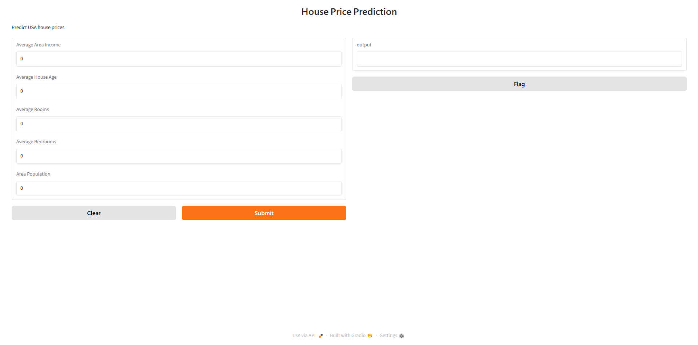

# House Price Prediction & Deployment

## Overview

This project develops a machine learning model to predict house prices using the USA Housing dataset. The project covers the complete machine learning workflow including Exploratory Data Analysis (EDA), data preprocessing, model training, model comparison, model selection, and deployment through a Gradio web application.

The objective is to identify the most important factors affecting house prices and build an accurate regression model that can estimate the price of a house based on its characteristics.

---

## Dataset

**Source:** USA Housing Dataset

**Target Variable:** Price

### Features Used

* Avg. Area Income
* Avg. Area House Age
* Avg. Area Number of Rooms
* Avg. Area Number of Bedrooms
* Area Population

### Feature Excluded

* Address (text feature with high cardinality and limited predictive value for this regression task)

### Dataset Summary

* Total Samples: 5000
* Total Features: 7
* Missing Values: 0
* Duplicate Records: 0

---

## Exploratory Data Analysis (EDA)

### Key Findings

1.	**Avg. Area Income** has the strongest positive correlation with house price, making it the most important predictor.
2.	**Avg. Area House Age** also shows a strong positive relationship with house price. Houses with more rooms generally have higher prices.
3.	**Area Population** has a moderate positive correlation with house price, indicating that areas with older houses tend to have slightly higher property values.
4.	**Avg. Area Number of Rooms** has a moderate impact on house prices, suggesting that population density contributes to property valuation.
5.	**Avg. Area Number of Bedrooms** has the weakest correlation with house price among the numerical features.
6. Most relationships between features and price appear approximately linear.
7. No missing values or duplicate records were found.
8. Address was removed because it is not suitable for standard regression models.


### Visualizations Created

* House Price Distribution
* Feature Distributions
* Correlation Heatmap
* Price vs Income Scatter Plot
* Price vs House Age Scatter Plot
* Price vs Rooms Scatter Plot
* Price vs Population Scatter Plot

---

## Data Preprocessing

### Steps Performed

1. Removed the Address column.
2. Selected numerical features for modeling.
3. Split data into training and testing sets using an 80/20 ratio.
4. Applied StandardScaler for feature scaling.
5. Built machine learning pipelines for consistent preprocessing and training.

---

## Model Comparison

| Model                         | Train R² | Test R² | Test MSE       |
| ----------------------------- | -------- | ------- | -------------- |
| Linear Regression             | 0.918    | 0.918   | 10,089,009,301 |
| Ridge Regression              | 0.918    | 0.918   | 10,089,003,189 |
| Lasso Regression              | 0.918    | 0.918   | 10,089,007,632 |
| Polynomial Regression + Ridge | 0.918    | 0.918   | 10,099,222,957 |
| KNN Regressor (k=5)           | 0.911    | 0.869   | 16,078,241,761 |

---

## Final Model

### Model Selected

**Ridge Regression**

### Performance

* Train R²: 0.918
* Test R²: 0.918
* Test MSE: 10,089,003,189

### Why This Model Was Chosen

Ridge Regression achieved the best overall performance among all tested models. It produced the highest Test R² score and one of the lowest Mean Squared Error values while maintaining excellent generalization between training and testing datasets.

The EDA showed mostly linear relationships between predictors and house prices. Ridge Regression effectively captures these relationships while reducing the risk of overfitting through regularization.

---

## Web Application

The trained Ridge Regression model was deployed using Gradio.

### Features

* User-friendly interface
* Real-time house price prediction
* Numerical input fields for all housing features
* Instant prediction output

### Screenshot

Place a screenshot of your Gradio interface inside:

screenshots/gradio_interface.png

Example:



---

## Project Structure

house-price-prediction/

├── data/

│ └── USA_Housing.csv

├── notebooks/

│ ├── 1_eda.ipynb

│ └── 2_training.ipynb

├── models/

│ └── best_model.pkl

├── screenshots/

│ └── gradio_interface.png

├── app.py

├── README.md

└── requirements.txt

---

## Installation

Clone the repository:

```bash
git clone [GitHub Repository Link]
cd house-price-prediction
```

Install required packages:

```bash
pip install -r requirements.txt
```

---

## Usage

Run the Gradio application:

```bash
python app.py
```

The application will launch in your browser and allow users to predict house prices by entering housing information.

---

## Technologies Used

* Python
* Pandas
* NumPy
* Matplotlib
* Seaborn
* Scikit-learn
* Gradio
* Joblib

---

## Conclusion

This project successfully developed and deployed a machine learning model for house price prediction. Through exploratory data analysis and model comparison, Ridge Regression was identified as the most effective model. The final solution provides accurate predictions and is accessible through an interactive Gradio web application.

---

### Author

**[Md Anwar Zaied]**

GitHub Repository:

**[https://github.com/zaied15/House-Price-Prediction]**
